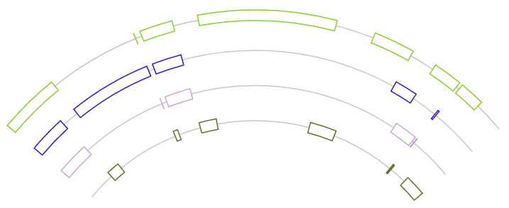

# segmentplacer

This repository contains prototype implementations in D3.js for the algorithms in the paper [Placing Segments On Parallel Arcs (2018)](https://link.springer.com/chapter/10.1007/978-3-319-94667-2_25), meant only for testing the feasibility of the algorithms therein. 

- Figure 2a: [View codes](https://github.com/kalngyk/segmentplacer/blob/master/figure2a.html) / [Run codes to view output](https://kalngyk.github.io/segmentplacer/figure2a.html)
- Figure 2b: [View codes](https://github.com/kalngyk/segmentplacer/blob/master/figure2b.html) / [Run codes to view output](https://kalngyk.github.io/segmentplacer/figure2b.html)
- Figure 2c: [View codes](https://github.com/kalngyk/segmentplacer/blob/master/figure2c.html) / [Run codes to view output](https://kalngyk.github.io/segmentplacer/figure2c.html)
- Figure 2d: [View codes](https://github.com/kalngyk/segmentplacer/blob/master/figure2d.html) / [Run codes to view output](https://kalngyk.github.io/segmentplacer/figure2d.html)

